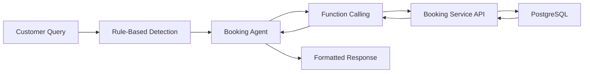

# WhatsApp CRM - Multi-Tenant SaaS Platform

A production-ready, LLM-powered WhatsApp customer service platform built with microservices architecture.

## Overview

This platform enables businesses to automate WhatsApp customer service using AI (GPT-4o-mini) with RAG (Retrieval-Augmented Generation), intelligent handoff to human agents, and comprehensive analytics.

**Key Features**:
- Multi-tenant SaaS architecture
- **Multi-agent LLM system** with specialized agents for optimal performance
- **Booking availability checks** with intelligent date parsing (Indonesian + English)
- LLM-powered responses with knowledge base integration (RAG)
- Smart handoff to human agents
- Real-time conversation dashboard
- Usage-based billing with quotas
- Vector search with Qdrant
- Event-driven architecture with Pub/Sub
- **Sports facility management** (futsal, tennis, badminton courts)

## Technology Stack

| Service | Language | Framework | Port |
|---------|----------|-----------|------|
| Tenant Service | Node.js | NestJS | 3001 |
| Billing Service | Go | Gin | 3002 |
| Knowledge Service | Python | FastAPI | 3003 |
| Conversation Service | Node.js | Express + Socket.IO | 3004 |
| LLM Orchestration | Python | FastAPI + OpenAI | 3005 |
| Message Sender | Go | Gin | 3006 |
| Analytics Service | Python | FastAPI | 3007 |
| **Booking Service** | Go | Gin | 3008 |

**Infrastructure**: GCP (Cloud Run, Cloud SQL, Pub/Sub, Cloud Storage, BigQuery)

## Quick Start

### Prerequisites

- Docker & Docker Compose
- Node.js 22+
- Python 3.11+
- Go 1.21+
- gcloud CLI (for deployment)

### Local Development Setup

1. **Clone the repository**
   ```bash
   git clone <repository-url>
   cd crm-product
   ```

2. **Set up environment variables**
   ```bash
   cp .env.example .env
   # Edit .env with your credentials
   ```

3. **Start infrastructure services**
   ```bash
   cd infrastructure/docker
   docker-compose up -d
   ```

4. **Verify services are running**
   ```bash
   docker-compose ps
   ```

   You should see:
   - PostgreSQL (port 5432)
   - Redis (port 6379)
   - Pub/Sub Emulator (port 8085)
   - Qdrant (port 6333)

5. **Access the database**
   ```bash
   docker-compose exec postgres psql -U crm_user -d crm_dev
   ```

## Project Structure

```
crm-product/
├── services/
│   ├── tenant-service/          # Tenant & outlet management (NestJS)
│   ├── billing-service/         # Subscriptions & quotas (Go)
│   ├── knowledge-service/       # Document processing & RAG (FastAPI)
│   ├── conversation-service/    # Conversation state & WebSocket (Express)
│   ├── llm-orchestration-service/  # LLM integration (FastAPI)
│   ├── message-sender-service/  # WhatsApp API integration (Go)
│   └── analytics-service/       # Metrics & reporting (FastAPI)
├── infrastructure/
│   ├── docker/
│   │   ├── docker-compose.yml
│   │   └── init-db.sql
│   └── terraform/               # GCP infrastructure (planned)
├── docs/
│   ├── api-specs/
│   └── runbooks/
├── .github/workflows/           # CI/CD pipelines
├── .env.example
├── .gitignore
├── claude.md                    # Master architecture reference
└── README.md
```

## Development Workflow

### Working on a Service

Each service has its own directory with a standard structure:

**Node.js Services (NestJS/Express)**:
```
tenant-service/
├── src/
│   ├── main.ts
│   ├── modules/
│   ├── controllers/
│   ├── services/
│   └── dto/
├── tests/
├── Dockerfile
├── package.json
└── README.md
```

**Go Services**:
```
billing-service/
├── cmd/
│   └── server/
│       └── main.go
├── internal/
│   ├── handlers/
│   ├── models/
│   └── services/
├── pkg/
├── Dockerfile
├── go.mod
└── README.md
```

**Python Services (FastAPI)**:
```
knowledge-service/
├── app/
│   ├── main.py
│   ├── routers/
│   ├── models/
│   └── services/
├── tests/
├── Dockerfile
├── requirements.txt
└── README.md
```

### Database Migrations

The initial schema is created automatically via `init-db.sql`. For schema changes:

```bash
# Connect to database
docker-compose exec postgres psql -U crm_user -d crm_dev

# Run migration
\i /path/to/migration.sql
```

### Testing Services

```bash
# Start infrastructure
cd infrastructure/docker
docker-compose up -d

# Test individual service health
curl http://localhost:3001/health   # Tenant Service
curl http://localhost:3002/health   # Billing Service
curl http://localhost:3003/health   # Knowledge Service
```

## Architecture Highlights

### Multi-Tenant Isolation

All database tables use Row-Level Security (RLS) with `tenant_id` filtering:

```sql
-- Set tenant context
SET app.current_tenant_id = 'tenant-uuid';

-- All queries automatically filtered by tenant
SELECT * FROM outlets;  -- Only returns outlets for current tenant
```

### Event-Driven Communication

Services communicate via Google Pub/Sub:

**Topics**:
- `whatsapp.incoming.messages` - New messages from customers
- `whatsapp.outgoing.messages` - Responses to send
- `knowledge.document.uploaded` - New documents to process
- `billing.quota.warning` - Quota threshold alerts
- `conversation.completed` - Finished conversations

### RAG Pipeline (Knowledge Service → LLM Orchestration)

1. Document uploaded → parsed → chunked (500 tokens, 50 overlap)
2. Embeddings generated (text-embedding-3-small)
3. Vectors stored in Qdrant with tenant isolation
4. Query time: retrieve top-5 relevant chunks (min score 0.7)
5. Inject context into LLM prompt

### Booking Availability System 🆕

**Real-time availability checks for sports facilities with intelligent date parsing:**

**Flow:**


**Example Queries:**
- Indonesian: `"futsal tanggal 23 kosong jam berapa?"` → Shows all available slots for Nov 23
- Indonesian: `"saya mau booking futsal besok"` → Shows tomorrow's availability
- English: `"tennis court available when?"` → Asks for date clarification
- Vague: `"kapan lapangan futsal kosong?"` → Asks for specific date

**Date Parsing:**
- `"tanggal 23"` → 2025-11-23 (current year-month + day)
- `"besok"` → Tomorrow's date
- `"lusa"` → Day after tomorrow
- `"hari ini"` → Today's date

**Resource Types:**
- `field` - Futsal fields, soccer fields, basketball courts
- `court` - Tennis courts, badminton courts
- `room` - Meeting rooms
- `equipment` - Rental equipment

**Testing:**
```bash
# Populate sample sports resources
python add_sports_resources.py

# Run availability check tests
python test_booking_inquiry.py
```

**API Endpoint:**
```bash
GET /api/v1/bookings/availability/check?date=2025-11-23&resource_type=field
Headers:
  X-Tenant-Id: 00000000-0000-0000-0000-000000000001

Response:
{
  "availabilities": [
    {
      "resource_name": "Futsal Field A",
      "available_slots": [
        {"start_time": "08:00", "end_time": "09:00", "price": 100000},
        ...
      ]
    }
  ]
}
```

📘 **Full Documentation:** See `/docs-site/docs/features/booking-availability.md`

### Subscription Tiers

| Tier | Price | Messages | Outlets | KB Limit | Storage |
|------|-------|----------|---------|----------|---------|
| Starter | $99/mo | 500 | 1 | 1 | 50 MB |
| Growth | $299/mo | 2,000 | 3 | 3 | 200 MB |
| Enterprise | $799/mo | 10,000 | 10 | Unlimited | 1 GB |

## Deployment

### Local Development
```bash
cd infrastructure/docker
docker-compose up -d
```

### GCP Production (Cloud Run)
```bash
# Build and push image
gcloud builds submit --tag gcr.io/PROJECT_ID/tenant-service:v1.0.0

# Deploy
gcloud run deploy tenant-service \
  --image gcr.io/PROJECT_ID/tenant-service:v1.0.0 \
  --region asia-southeast2 \
  --platform managed \
  --set-env-vars DATABASE_URL=...
```

## Documentation

- **Architecture Guide**: See [claude.md](claude.md) for complete specifications
- **Quick Start**: [quickstart-guide.md](quickstart-guide.md)
- **API Specs**: `docs/api-specs/`
- **Runbooks**: `docs/runbooks/`

## Security

- **Authentication**: Firebase Auth with JWT
- **Authorization**: Role-based (admin, agent, viewer)
- **Data Encryption**: AES-256 at rest, TLS 1.3 in transit
- **Multi-Tenant Isolation**: RLS + application-level filtering
- **Secrets Management**: Cloud Secret Manager (production)

## Monitoring

- **Metrics**: Prometheus + Grafana
- **Logging**: Cloud Logging (structured JSON)
- **Tracing**: OpenTelemetry
- **Alerts**: Quota warnings, high error rates, latency spikes

## License

Proprietary - All rights reserved

## Support

- **Issues**: GitHub Issues
- **Documentation**: [claude.md](claude.md)
- **Architecture Questions**: See master reference document

---

**Version**: 1.0.0
**Last Updated**: October 30, 2025